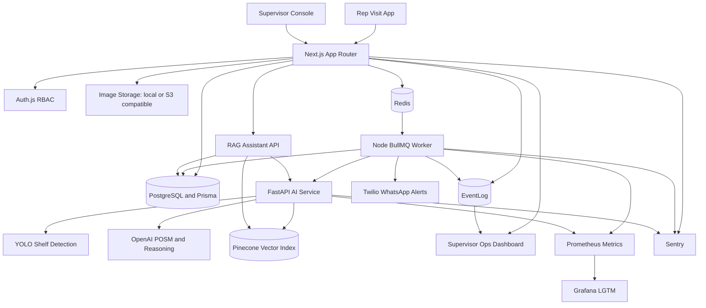
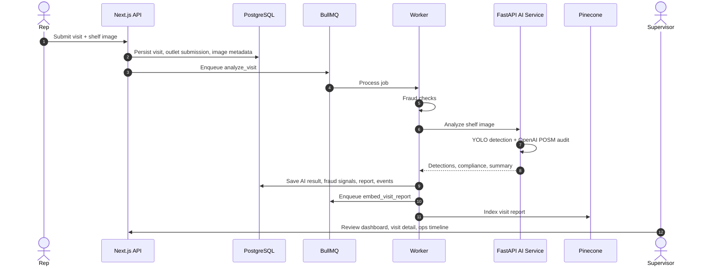
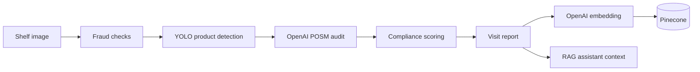

# RetailOS Lite


RetailOS Lite is an AI-native retail execution system for field rep store visits, shelf image analysis, compliance scoring, fraud detection, governed outlet master data, supervisor dashboards, and RAG-based operational intelligence.

Built as a 72-hour rapid sprint project, it is intentionally local-first for demo reliability while keeping production-shaped boundaries: async queues, isolated AI service, durable database state, structured observability, RBAC, offline sync, and deployable container services.

## Architecture



## What It Does

| Area | Status | Implementation |
| --- | --- | --- |
| Store visit workflow | Complete | Rep check-in, GPS capture, outlet entry/search, notes, single-image shelf evidence |
| AI shelf analysis | Complete | YOLO detects Olympic Foodie Noodles and competitor presence; OpenAI audits POSM and shelf quality |
| Compliance scoring | Complete | Deterministic score from visibility, competitor pressure, POSM, and fraud context |
| Supervisor dashboard | Complete | Visit metrics, compliance, missing POSM, fraud counts, visit logs, image history |
| Fraud detection | Complete | Exact duplicate image, perceptual hash duplicate, GPS distance, timestamp anomaly, EXIF mismatch |
| Async processing | Complete | BullMQ jobs, retries, DLQ, worker metrics, event timeline |
| RAG assistant | Complete | Exact database grounding plus Pinecone semantic recall over visit reports |
| Offline sync | Complete | IndexedDB queue with TanStack Query integration for offline rep submissions |
| Outlet governance | Complete | Master outlet registry, match confidence, review queue, aliases, duplicate merge |
| RBAC | Complete | Rep and supervisor route/API authorization |
| WhatsApp alerts | Complete | Twilio alerts for fraud signals and new outlet submissions |
| Observability | Complete | Sentry, structured logs, EventLog, Prometheus, Loki, Tempo, Grafana, `/supervisor/ops` |

## Core Workflow



## Tech Stack

| Layer | Stack |
| --- | --- |
| Web app | Next.js App Router, React, TypeScript, Tailwind |
| Auth and RBAC | Auth.js, route guards, role-aware API access |
| Database | PostgreSQL, Prisma |
| Queue | Redis, BullMQ |
| Worker | Node.js, TypeScript, Prometheus metrics |
| AI service | FastAPI, Python, YOLO, OpenAI, Pinecone |
| Storage | Local uploads for demo, S3-compatible abstraction, MinIO service available in Docker |
| Offline | IndexedDB, TanStack Query |
| Observability | Sentry, Pino/JSON logs, EventLog, Grafana, Loki, Tempo, Prometheus |
| Alerts | Twilio WhatsApp |

## Quick Start

Prerequisites:

- Node.js 22+
- Docker Desktop
- OpenAI API key in `ai_service/.env`
- Pinecone key, index, and host in `ai_service/.env` for RAG indexing
- YOLO weights at `Detection Model/best.pt`

Start the full demo stack:

```bash
npm install
npm run demo:build
npm run demo:up:detached
npm run demo:logs
```

Seeded demo accounts:

| Role | Email | Password |
| --- | --- | --- |
| Rep | `rep@demo.com` | `demo123` |
| Supervisor | `supervisor@demo.com` | `demo123` |

Useful local URLs:

| Service | URL | Notes |
| --- | --- | --- |
| App | http://127.0.0.1:3000 | Login, rep flow, supervisor console |
| Rep visit flow | http://127.0.0.1:3000/rep/visits/new | Field submission workflow |
| Supervisor dashboard | http://127.0.0.1:3000/supervisor | Executive overview |
| Ops dashboard | http://127.0.0.1:3000/supervisor/ops | Queue health, timelines, events |
| AI service readiness | http://127.0.0.1:8001/ready | FastAPI health check |
| Worker metrics | http://127.0.0.1:9101/metrics | Prometheus scrape target |
| Grafana | http://127.0.0.1:3005 | `admin` / `retailos` |
| Prometheus | http://127.0.0.1:9090 | Metrics explorer |
| MinIO console | http://127.0.0.1:19001 | `retailos` / `retailos-secret` |

Stop the stack:

```bash
npm run demo:down
```

## Development Commands

| Command | Purpose |
| --- | --- |
| `npm run dev` | Start Next.js locally |
| `npm run build` | Build the Next.js app |
| `npm run check:worker` | Type-check worker code |
| `npm run worker` | Run the BullMQ worker locally |
| `npm run db:push` | Push Prisma schema to the database |
| `npm run db:seed` | Seed demo users, outlets, and visits |
| `npm run rag:index-reports` | Re-index visit reports into Pinecone |
| `npm run test:outlet-resolution` | Exercise outlet matching and duplicate prevention |
| `npm run test:whatsapp` | Send a test WhatsApp alert |
| `npm run test:whatsapp:fraud` | Send a fraud-alert WhatsApp test |

## AI Pipeline



YOLO provides grounded product and competitor detections. OpenAI is used where classical detection is intentionally weaker for the sprint: POSM recognition, shelf quality reasoning, supervisor-ready summaries, and assistant answer generation. Compliance remains deterministic so scores are inspectable and stable.

## Data Model Snapshot

Primary operational entities:

- `Visit`, `VisitImage`, `AIResult`, `FraudSignal`, `VisitReport`
- `Outlet`, `OutletAlias`, `OutletSubmission`
- `EventLog` for workflow timelines and operational debugging
- User/session records for Auth.js and RBAC

Outlet management is governed master data, not simple CRUD. Reps submit names and GPS quickly; the system resolves possible matches, creates pending outlets when needed, and lets supervisors approve, reject, or merge duplicates without orphaning visit history.

## Observability

RetailOS Lite exposes both external observability and in-product operational visibility:

- Sentry captures app, worker, and AI service errors with correlation IDs.
- Structured JSON logs are written for web, worker, and AI service.
- Prometheus scrapes queue, worker, AI, assistant, and latency metrics.
- Loki and Tempo back local logs and traces.
- Grafana ships with provisioned local dashboards.
- `/supervisor/ops` shows queue health, failed jobs, recent events, assistant timing, and per-visit processing timelines.

## Documentation

| Document | Scope |
| --- | --- |
| [Showcase Demo Runbook](docs/SHOWCASE_DEMO_RUNBOOK.md) | 35-minute demo script and talking points |
| [System Documentation Index](docs/systems/README.md) | Subsystem-level handoff pack |
| [System Map](docs/systems/system-map.md) | End-to-end architecture and service boundaries |
| [Rep Visit Workflow](docs/systems/rep-visit-workflow.md) | Field workflow, offline sync, submit lifecycle |
| [Supervisor Experience](docs/systems/supervisor-experience.md) | Dashboard, logs, inspection, outlet verification, ops page |
| [Image ML And Compliance](docs/systems/image-ml-and-compliance.md) | YOLO, OpenAI POSM, scoring, service contracts |
| [Fraud Detection](docs/systems/fraud-detection.md) | Fraud signals, thresholds, persistence |
| [Chatbot And RAG](docs/systems/chatbot-rag.md) | Assistant grounding, Pinecone retrieval, answer generation |
| [Outlet Master Data](docs/systems/outlet-master-data.md) | Matching, aliases, duplicate prevention, merge behavior |
| [Observability](docs/systems/observability.md) | Sentry, LGTM, EventLog, ops dashboard |
| [Security And RBAC](docs/systems/security-and-rbac.md) | Auth, OAuth scaffold, authorization, service security posture |
| [Deployment And Operations](docs/systems/deployment-and-operations.md) | Docker topology, env, seeding, production path |
| [Production Hardening Sprint](docs/PRODUCTION_HARDENING_SPRINT.md) | Consolidated gap register, implemented hardening slice, remaining backlog |

## Production Path

The demo stack is local-first, but the boundaries map cleanly to cloud infrastructure:

- Next.js app on Vercel, ECS, or another container platform
- Worker and FastAPI service as separate containers
- RDS PostgreSQL with PgBouncer or Prisma Accelerate
- ElastiCache Redis for BullMQ
- S3 or Cloudflare R2 for image storage through the existing storage abstraction
- Secrets Manager or platform secrets for OpenAI, Pinecone, Twilio, Sentry, and auth secrets
- Managed Grafana or hosted Sentry for production observability

Known hardening items before production: signed direct uploads, Redis/WAF-backed distributed rate limits, mandatory AI-service authentication outside local, database connection pooling, and full object-storage migration away from local demo uploads.

## Project Status

RetailOS Lite is showcase-ready for the sprint assessment: the critical business workflow is complete, AI processing is asynchronous, the supervisor experience is operationally useful, and the system demonstrates multiple bonus capabilities without turning the codebase into a science project.

License: private assessment project.
