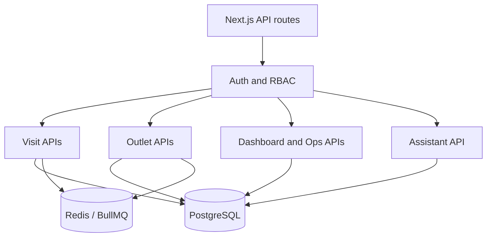
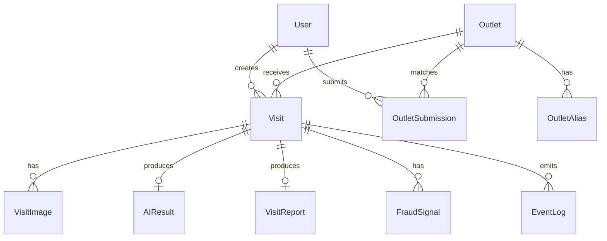

# API And Data Model

## Purpose

This document summarizes the product API and database model. Detailed behavior lives in the subsystem docs.

## Auth Model

All app APIs use session auth through `requireApiSession`.

| Role group | Roles |
| --- | --- |
| `authenticated` | `REP`, `SUPERVISOR`, `ADMIN` |
| `rep` | `REP` |
| `supervisor` | `SUPERVISOR`, `ADMIN` |

## Product APIs

### Visits

| Method | Route | Auth | Purpose |
| --- | --- | --- | --- |
| `GET` | `/api/visits` | Authenticated | Visit list; rep scoped unless supervisor/admin |
| `POST` | `/api/visits` | `REP` | Create/resume visit and resolve outlet |
| `GET` | `/api/visits/:id` | Owner rep or supervisor/admin | Visit detail |
| `POST` | `/api/visits/:id/images` | Owner rep | Upload one shelf image |
| `POST` | `/api/visits/:id/submit` | Owner rep | Queue async analysis |

Visit list query params:

| Param | Notes |
| --- | --- |
| `scope` | `all` or `mine` |
| `page`, `pageSize` | Enables paginated response |
| `status` | `all`, `safe`, `flagged`, `review-needed`, `high-risk` |
| `q` | Outlet/rep search |
| `from`, `to` | Created-at filter |

### Dashboard/Ops

| Method | Route | Auth | Purpose |
| --- | --- | --- | --- |
| `GET` | `/api/dashboard` | Supervisor | Overview metrics and trends |
| `GET` | `/api/ops` | Supervisor | Queue health, timelines, failures, latency |
| `GET` | `/api/metrics` | Public/internal | Prometheus metrics |

### Outlets

| Method | Route | Auth | Purpose |
| --- | --- | --- | --- |
| `GET` | `/api/outlets` | Authenticated | Master outlet list |
| `POST` | `/api/outlets` | Authenticated | Create outlet directly |
| `POST` | `/api/outlets/search` | Authenticated | Nearby/fuzzy outlet candidates |
| `POST` | `/api/outlets/submit` | `REP` | Resolve outlet selection |
| `GET` | `/api/outlets/pending` | Supervisor | Pending review queue |
| `POST` | `/api/outlets/:id/approve` | Supervisor | Approve outlet/submission |
| `POST` | `/api/outlets/:id/reject` | Supervisor | Reject outlet/submission |
| `POST` | `/api/outlets/:id/merge` | Supervisor | Merge duplicate into canonical outlet |

### Assistant

| Method | Route | Auth | Purpose |
| --- | --- | --- | --- |
| `POST` | `/api/assistant/query` | Supervisor | Exact context + RAG assistant answer |

## AI Service APIs

| Method | Route | Purpose |
| --- | --- | --- |
| `GET` | `/health` | Health |
| `GET` | `/ready` | Readiness |
| `GET` | `/model` | Model metadata |
| `GET` | `/metrics` | Prometheus metrics |
| `POST` | `/detect-yolo` | YOLO-only detection |
| `POST` | `/detect-yolo/upload` | Multipart YOLO test |
| `POST` | `/analyze-shelf` | Main shelf analysis |
| `POST` | `/rag/index-report` | Embed/upsert visit report |
| `POST` | `/assistant/query` | Generate assistant answer |

Protected with `x-api-key` when configured.

## Core Tables

| Table | Primary purpose |
| --- | --- |
| `User` | Identity and role |
| `Outlet` | Canonical store registry |
| `OutletAlias` | Local/historical names for matching |
| `OutletSubmission` | Rep candidate and supervisor review state |
| `Visit` | Store visit lifecycle |
| `VisitImage` | Shelf evidence image and metadata |
| `AIResult` | Structured image analysis and compliance result |
| `VisitReport` | RAG-ready text/facts |
| `FraudSignal` | Actionable and informational fraud signals |
| `EventLog` | Audit and ops timeline |

## Status Enums

`Visit.status`:

| Status | Meaning |
| --- | --- |
| `PENDING` | Visit created, not submitted |
| `ANALYZING` | Analysis queued or running |
| `COMPLETE` | Analysis completed without flag condition |
| `FLAGGED` | Critical compliance or high fraud |
| `FAILED` | Worker failed terminally |

`Outlet.verificationStatus`:

| Status | Meaning |
| --- | --- |
| `VERIFIED` | Canonical approved outlet |
| `UNVERIFIED` | Needs supervisor review |
| `REJECTED` | Rejected or duplicate source |

`OutletSubmission.status`:

| Status | Meaning |
| --- | --- |
| `AUTO_MATCHED` | System confidently linked existing outlet |
| `PENDING_REVIEW` | Supervisor decision needed |
| `NEW_OUTLET` | New outlet candidate |
| `APPROVED` | Supervisor approved |
| `REJECTED` | Supervisor rejected |
| `MERGED` | Duplicate merged into canonical outlet |

## Important Indexes

Hot-path indexes exist for:

- visit creation/listing: `Visit(createdAt)`, `Visit(repId, createdAt)`, `Visit(outletId, createdAt)`, `Visit(status, createdAt)`
- image/fraud: `VisitImage(visitId)`, `VisitImage(imageHash)`, `FraudSignal(visitId)`, `FraudSignal(type, createdAt)`
- ops: `EventLog(createdAt)`, `EventLog(visitId, createdAt)`, `EventLog(event, createdAt)`
- outlets: `Outlet(normalizedName)`, `Outlet(verificationStatus, createdAt)`, `OutletSubmission(status, createdAt)`
- RAG: `VisitReport(outletId)`, `VisitReport(updatedAt)`

## Cascade Behavior

Current Prisma schema cascades:

- `VisitImage` on `Visit`
- `AIResult` on `Visit`
- `VisitReport` on `Visit`
- `FraudSignal` on `Visit`
- `OutletAlias` on `Outlet`

External systems do not cascade automatically:

- Pinecone vectors must be explicitly deleted or overwritten.
- Object storage files are not automatically deleted on DB row deletion.
