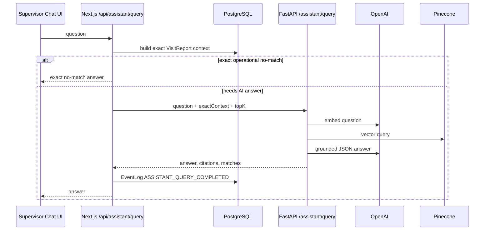
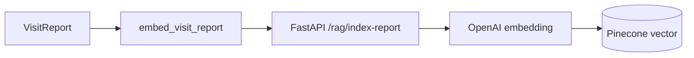

# Chatbot And RAG

## Purpose

The supervisor assistant answers operational questions over previous visits. It combines exact database context with vector retrieval so list/count questions remain reliable while narrative questions can use semantic memory.

## UI And APIs

| Layer | Code | Purpose |
| --- | --- | --- |
| UI | `components/assistant-chat.tsx` | Chat surface and local conversation persistence |
| Route | `/supervisor/insights` | Supervisor AI insights page |
| Next API | `POST /api/assistant/query` | Auth, exact context, AI service call, EventLog |
| Exact context | `lib/assistant.ts` | Prisma report selection and intent handling |
| AI service | `ai_service/app/rag.py` | Embeddings, Pinecone query, GPT answer |
| Index worker | `worker/src/queue.ts` | `embed_visit_report` consumer |

## Query Flow



```text
Supervisor asks question
  -> POST /api/assistant/query
  -> require SUPERVISOR or ADMIN
  -> build exact Prisma context from VisitReport + Visit + AIResult + FraudSignal
  -> if exact operational query has no matches, return exact no-match answer
  -> call AI service /assistant/query
  -> AI service embeds query
  -> Pinecone vector search
  -> GPT answer from exact context and semantic matches
  -> EventLog ASSISTANT_QUERY_COMPLETED
```

## Why Exact Context Comes First

Questions like these must not rely on vector similarity:

- "Which outlets have fraud signals?"
- "Which outlets are failing compliance?"
- "Which visits are missing POSM?"
- "Show flagged visits."

For those, the app filters exact database context before calling the LLM. Vector matches are supplemental and cannot prove fraud/compliance lists.

## Exact Context Fields

Each exact context item includes:

- `visitId`
- `outletId`
- `outletName`
- `visitDate`
- `complianceScore`
- `complianceStatus`
- `riskStatus`
- `fraudCount`
- `missingPosm`
- `summary`
- `retrievalText`

The context is built from the latest `VisitReport` rows with joined visit, outlet, AI result, and fraud signals.

## Report Indexing



Every analyzed visit creates a `VisitReport`:

```text
Outlet: Rahim Store
Outlet ID: outlet_123
Visit ID: visit_123
Rep ID: user_123
Compliance Score: 42
Compliance Status: poor
Supervisor Summary: Missing POSM and weak Olympic visibility.
Olympic Products Detected: 3
Competitors Detected: 8
Olympic Visibility Ratio: 0.27
POSM Detected: false
POSM Evidence: No Olympic-branded material visible.
Fraud Signals: No fraud signals detected.
Recommended Action: Add POSM and improve shelf share.
```

Index flow:

```text
VisitReport saved
  -> embed_visit_report job
  -> POST /rag/index-report
  -> OpenAI text-embedding-3-small
  -> Pinecone upsert vector id visit-report:{visitId}
```

Pinecone metadata:

- `visitId`
- `outletId`
- `title`
- `summary`
- `retrievalText`
- `createdAt`
- `source=visit_report`

## Assistant Generation

Model is configured via:

```env
RETAILOS_CHAT_MODEL=gpt-5.4-mini
RETAILOS_EMBEDDING_MODEL=text-embedding-3-small
RETAILOS_EMBEDDING_DIMENSIONS=512
```

The AI service asks for a JSON schema response:

- `answer`
- `citations[]`

System rules include:

- Answer only from supplied context.
- Prefer exact database context for list/count/fraud/POSM/compliance.
- Only name fraud outlets when exact `fraudCount > 0`.
- Do not treat `REVIEW_NEEDED` as fraud.
- Keep answers operational and concise.

## API Request

```json
{
  "question": "Which outlets are failing compliance?",
  "topK": 5
}
```

## API Response

```json
{
  "answer": "Maa Store is failing compliance with a 42% score because Olympic visibility is low and POSM is missing.",
  "citations": [
    {
      "visitId": "visit_123",
      "outletName": "Maa Store",
      "reason": "Exact database context"
    }
  ],
  "matches": [],
  "model": "gpt-5.4-mini",
  "embeddingModel": "text-embedding-3-small",
  "retrievalMode": "exact_and_vector",
  "warnings": [],
  "exactContextCount": 1
}
```

## Maintenance Commands

Backfill current DB reports:

```powershell
npm run rag:index-reports -- --dry-run --limit=10
npm run rag:index-reports -- --limit=100
```

Clear Pinecone namespace for demo reset:

```powershell
docker compose -f docker-compose.demo.yml exec ai-service python -c "from ai_service.app import config; from ai_service.app.rag import pinecone_post; pinecone_post('/vectors/delete', {'namespace': config.PINECONE_NAMESPACE, 'deleteAll': True}); print('cleared', config.PINECONE_NAMESPACE)"
```

## Outlet Merge Consistency

When duplicate outlets are merged:

- Visit reports are retargeted to the canonical outlet.
- Retrieval text is updated.
- Affected reports are queued for reindex.
- Pinecone vectors are overwritten under the same `visit-report:{visitId}` ids.

## Known Gaps

- Pinecone is external state; database deletes do not cascade automatically.
- No DLQ replay for failed embedding jobs.
- No pgvector mirror inside Postgres.
- The intent parser is pragmatic, not a full semantic query planner.
