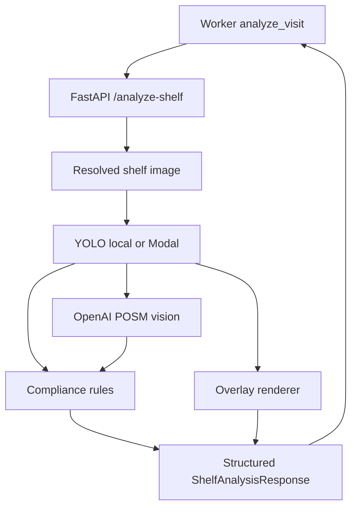

# Image ML And Compliance

## Purpose

The image intelligence stack converts one shelf image into structured retail execution facts:

- Olympic/Foodie product presence.
- Mr. Noodles competitor presence.
- Share-of-shelf approximations.
- Olympic POSM visibility.
- Shelf quality notes.
- Compliance score, reasons, and supervisor summary.

## Services



| Component | Code | Purpose |
| --- | --- | --- |
| FastAPI routes | `ai_service/app/main.py` | AI service API |
| YOLO backend | `ai_service/app/yolo_backend.py` | Local or Modal inference routing |
| YOLO detector | `ai_service/app/yolo_detector.py` | Local model loading and detection |
| Overlay generation | `ai_service/app/overlay.py` | Annotated images |
| OpenAI vision | `ai_service/app/llm_analysis.py` | POSM/shelf/summary reasoning |
| Compliance | `ai_service/app/compliance.py` | Deterministic scoring |

## Model Classes

Expected YOLO class map:

```python
{
  0: "foodie_noodles_olympics",
  1: "mr_noodles_competitor"
}
```

The model was trained at `1280px`; runtime config defaults to `RETAILOS_YOLO_IMAGE_SIZE=1280`.

## AI Service Endpoints

| Endpoint | Purpose |
| --- | --- |
| `GET /health` | Process and model-load health |
| `GET /ready` | Deployment readiness |
| `GET /model` | Active model metadata |
| `GET /metrics` | Prometheus metrics |
| `GET /artifacts/overlays/:file` | Overlay image serving |
| `POST /detect-yolo` | YOLO-only detection |
| `POST /detect-yolo/upload` | Multipart YOLO test endpoint |
| `POST /analyze-shelf` | Main worker endpoint |

Protected when `RETAILOS_AI_SERVICE_API_KEY` is set:

- `/detect-yolo`
- `/detect-yolo/upload`
- `/analyze-shelf`
- `/rag/index-report`
- `/assistant/query`

## Analyze Shelf Request

```json
{
  "visitId": "visit_123",
  "imagePath": "/app/public/uploads/visits/visit_123/image.jpg",
  "imageUrl": "/uploads/visits/visit_123/image.jpg",
  "confidence": 0.25,
  "imageSize": 1280,
  "saveOverlay": true,
  "useLlm": true,
  "outletName": "Rahim Store",
  "repNotes": "Shelf near front counter."
}
```

`imagePath` is preferred for local worker/docker paths. `imageUrl` is fallback when the service must download the image.

## Response Shape

The response contains:

- `yolo`: counts, areas, metrics, detections, overlay URL.
- `llm`: POSM and visual audit result, or `null`.
- `compliance`: score, status, reasons, recommended action.
- `supervisorSummary`: short operational summary.
- `warnings`: non-fatal analysis issues.

## YOLO Output Semantics

Important fields:

| Field | Meaning |
| --- | --- |
| `counts.olympic` | Detected Olympic/Foodie products |
| `counts.competitor` | Detected Mr. Noodles competitor products |
| `metrics.visibilityRatio` | Olympic detected area divided by Olympic plus competitor detected area |
| `metrics.competitorAreaRatio` | Competitor detected area over image area |
| `detections[]` | Box, class, confidence, area |
| `overlayImageUrl` | Annotated image for inspection |

YOLO is used as grounding for counts and competitor presence, not for POSM.

## POSM Analysis

OpenAI vision prompt asks for:

- Olympic/Foodie POSM only.
- Shelf quality.
- Competitor pressure.
- Supervisor action.

Important rule:

- `posm.detected=true` only when Olympic/Foodie branded posters, wobblers, shelf strips, danglers, signage, stickers, or promotional material are clearly visible.
- Non-Olympic promotional material is described separately and must not count as Olympic POSM.

If OpenAI fails:

- Analysis still succeeds.
- `llm=null`.
- Compliance falls back to YOLO-only scoring.
- Response includes a warning.

## Compliance Scoring

Compliance is deterministic. It starts at `100` and applies penalties.

| Condition | Penalty |
| --- | ---: |
| No shelf products detected | `-75` |
| No Olympic products detected | `-45` |
| Olympic visibility below `0.25` | `-25` |
| Olympic visibility below `0.50` | `-15` |
| Competitor count greater than Olympic count and competitor count at least `3` | `-20` |
| Any competitor product present | `-5` |
| LLM ran and Olympic POSM is missing | `-15` |

Status bands:

| Score | Status |
| ---: | --- |
| `80-100` | `excellent` |
| `60-79` | `acceptable` |
| `40-59` | `poor` |
| `0-39` | `critical` |

The worker flags visits when compliance status is `critical` or there is high-severity fraud.

## Modal GPU

`RETAILOS_YOLO_BACKEND` controls inference backend:

| Value | Behavior |
| --- | --- |
| `local` | Load `Detection Model/best.pt` in FastAPI |
| `modal` | Call `RETAILOS_MODAL_YOLO_URL` |

If `RETAILOS_YOLO_FALLBACK_LOCAL=true`, Modal failures can fall back to local inference.

## Production Notes

- YOLO count accuracy is not perfect; the product story should frame YOLO as product/competitor grounding and OpenAI as visual context/POSM reasoning.
- Compliance should remain rule-based for explainability.
- Future work could add calibration datasets, confidence thresholds per class, and human review feedback loops.
