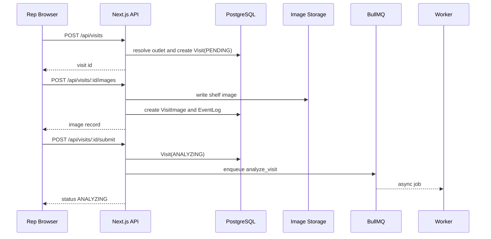

# Rep Visit Workflow

## Purpose

The rep flow captures field execution evidence quickly: outlet identity, GPS check-in, notes, one shelf image, and a submit action that starts async AI analysis.

## UI Routes

| Route | Purpose |
| --- | --- |
| `/rep/visits` | Rep visit log |
| `/rep/visits/new` | New visit workflow |
| `/rep/visits/:id` | Rep-facing post-submit analysis/results page |

## API Surface

| Endpoint | Auth | Purpose |
| --- | --- | --- |
| `POST /api/visits` | `REP` | Create or resume a visit; resolves outlet |
| `POST /api/visits/:id/images` | `REP` owner | Upload one shelf image |
| `POST /api/visits/:id/submit` | `REP` owner | Enqueue analysis |
| `GET /api/visits/:id` | Owner rep or supervisor/admin | Read visit detail |
| `GET /api/visits?scope=mine` | Authenticated | Rep-scoped visit list |

## Creation Flow



```text
Rep enters/searches shop name
  -> browser captures GPS
  -> /api/outlets/search returns nearby candidates
  -> rep selects existing outlet or continues as new
  -> POST /api/visits creates Visit(PENDING)
  -> POST /api/visits/:id/images stores one image
  -> POST /api/visits/:id/submit enqueues analyze_visit
  -> UI shows ANALYZING then polls detail
```

## Visit Creation Request

```json
{
  "clientVisitId": "offline_4e1b...",
  "outletName": "Maa Store",
  "outletId": "optional_existing_outlet_id",
  "forceNewOutlet": false,
  "checkInLat": 23.7801,
  "checkInLng": 90.4075,
  "clientTimestamp": "2026-05-24T09:10:00.000Z",
  "notes": "Shelf near entrance."
}
```

`clientVisitId` is an idempotency key. If the same rep retries a previously created visit, the existing visit is returned.

Offline outlet capture is intentionally server-authoritative. When the browser is offline, the client stores the typed outlet name and GPS as an unresolved claim with `forceNewOutlet: false`. During sync, `/api/visits` reruns normal outlet resolution against the current master outlet registry. Only unresolved low-confidence matches become new supervisor-reviewed outlets.

## Image Upload

The app intentionally allows one image per visit.

Reasoning:

- The YOLO/compliance pipeline is designed around one primary shelf evidence image.
- Multi-image submissions create duplicate-packet and cross-image interpretation complexity.
- For the demo, one image is easier to explain and less error-prone.

Request:

```text
POST /api/visits/:id/images
Content-Type: multipart/form-data

file=<image>
imageHash=<optional client-side hash>
```

Behavior:

- Rejects if no image is provided.
- Rejects with `409` if the visit already has an image.
- Stores through `lib/storage.ts`.
- Creates `VisitImage`.
- Emits `UPLOAD_STORED` EventLog with storage driver and latency.

## Submit Behavior

`POST /api/visits/:id/submit`:

- Requires at least one image.
- If status is not `PENDING`, returns current status without enqueueing again.
- Sets status to `ANALYZING`.
- Enqueues `analyze_visit` with job id `analyze-{visitId}`.
- Writes `VISIT_SUBMITTED` and `ANALYZE_VISIT_QUEUED`.

Response:

```json
{
  "status": "ANALYZING",
  "traceId": "visit_..."
}
```

## Offline Sync

Offline queue lives in IndexedDB:

- DB: `retailos-lite-offline`
- Store: `visitSubmissions`
- Code: `lib/offline-visits.ts`
- UI provider: `components/offline-visit-sync-provider.tsx`
- Status UI: `components/offline-sync-status.tsx`

Queued payload contains:

- `clientVisitId`
- outlet name or selected outlet id
- GPS
- timestamp
- notes
- one image blob and hash

Sync order:

```text
POST /api/visits
  -> POST /api/visits/:id/images
  -> POST /api/visits/:id/submit
  -> delete IndexedDB queue item on success
```

Retry policy:

- Retries network errors, `408`, `429`, and `5xx`.
- Marks non-retryable failures as `failed`.
- User can retry failed items when online.

## Status Semantics

| Status | Meaning |
| --- | --- |
| `PENDING` | Visit exists but has not been submitted |
| `ANALYZING` | Job queued or worker processing |
| `COMPLETE` | Analysis complete without high-risk/critical conditions |
| `FLAGGED` | Analysis complete with high-risk fraud or critical compliance |
| `FAILED` | Worker failed terminally after retries |

## Known Gaps

- The flow does not support multi-image visits.
- S3/MinIO mode uses direct-to-bucket signed uploads; local multipart upload remains as a dev fallback.
- Offline conflict resolution is intentionally simple: client idempotency, one image, retryable error classification, and server-side outlet resolution on sync.
