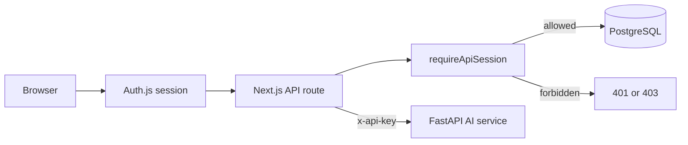

# Security And RBAC

## Purpose

Security is sprint-pragmatic but real: authenticated users, server-side role checks, route protection, service-to-service API key support, and explicit known gaps.

## Authentication



Auth is implemented with Auth.js/NextAuth.

Seeded demo users:

```text
rep@demo.com / demo123
supervisor@demo.com / demo123
```

Session user includes:

- `id`
- `name`
- `email`
- `role`

## Roles

| Role | Purpose |
| --- | --- |
| `REP` | Create and view own visits |
| `SUPERVISOR` | View all operational data and use assistant |
| `ADMIN` | Supervisor-equivalent in current demo |

Role groups in `lib/rbac.ts`:

```ts
authenticated: ["REP", "SUPERVISOR", "ADMIN"]
rep: ["REP"]
supervisor: ["SUPERVISOR", "ADMIN"]
```

## Server-Side Enforcement

Use `requireApiSession(allowedRoles)` for API routes.

Examples:

| Endpoint | Access |
| --- | --- |
| `POST /api/visits` | `REP` |
| `POST /api/visits/:id/images` | owning `REP` |
| `POST /api/visits/:id/submit` | owning `REP` |
| `GET /api/visits/:id` | owning rep or supervisor/admin |
| `GET /api/dashboard` | `SUPERVISOR`, `ADMIN` |
| `POST /api/assistant/query` | `SUPERVISOR`, `ADMIN` |
| Outlet approval/merge/reject | `SUPERVISOR`, `ADMIN` |

Client-side hiding is not treated as authorization.

## AI Service Auth

FastAPI protects inference/RAG endpoints when an API key is configured:

```env
RETAILOS_AI_SERVICE_API_KEY=shared-secret
```

Client header:

```text
x-api-key: shared-secret
```

Protected endpoints:

- `POST /analyze-shelf`
- `POST /detect-yolo`
- `POST /detect-yolo/upload`
- `POST /rag/index-report`
- `POST /assistant/query`

Open endpoints:

- `GET /health`
- `GET /ready`
- `GET /model`
- `GET /metrics`
- `GET /artifacts/overlays/...`

## Data Access Rules

Rep:

- Can create visits.
- Can upload one image to own visit.
- Can submit own visit.
- Can read own visit details.

Supervisor/Admin:

- Can read dashboards and all visits.
- Can approve/reject/merge outlets.
- Can use assistant.
- Can view ops dashboard.

## Secrets

Secrets are split:

- Root `.env` for app/worker/local runtime.
- `ai_service/.env` for AI-only secrets such as OpenAI and Pinecone.

Important secrets:

- `AUTH_SECRET`
- `NEXTAUTH_SECRET`
- `OPENAI_API_KEY`
- `PINECONE_API_KEY`
- `RETAILOS_AI_SERVICE_API_KEY`
- Twilio credentials
- S3/MinIO credentials
- Sentry DSN/token

## Known Security Gaps

| Gap | Current state | Production fix |
| --- | --- | --- |
| Credentials auth only | Good for demo | Use managed identity provider or hardened auth flow |
| No rate limits | Not implemented | Add route-level rate limits, especially assistant/upload |
| AI service public if exposed without key | API key optional | Require key in all non-local deployments |
| No object upload pre-signed URLs | Server-mediated uploads | Move browser uploads directly to object storage |
| No per-outlet territory ACL | Role-level ACL only | Add rep territory/outlet assignments |
| No audit actor on every EventLog | Some events include actor metadata | Standardize actor fields |

## Operational Guidance

- Never deploy with default auth secrets.
- Keep AI service private or API-key protected.
- Do not expose MinIO admin console publicly.
- Rotate OpenAI/Pinecone/Twilio keys after demos if shared.
