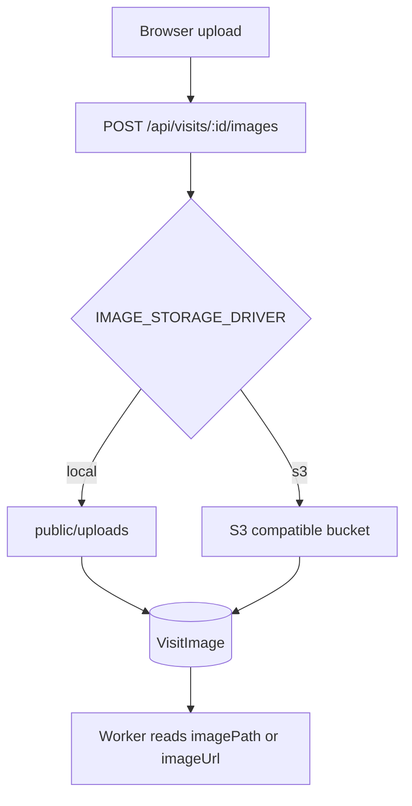
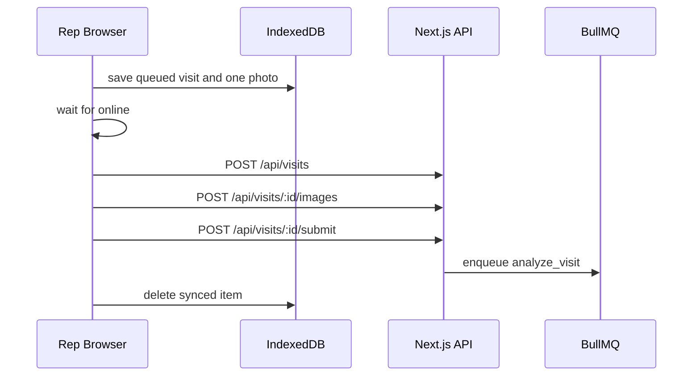

# Storage And Offline Sync

## Purpose

Storage and offline sync keep the rep workflow resilient: images persist outside form state, and visits can be queued when connectivity is unreliable.

## Image Storage

Code: `lib/storage.ts`



Supported drivers:

| Driver | Env | Use case |
| --- | --- | --- |
| Local | `IMAGE_STORAGE_DRIVER=local` | Fast local demo |
| S3-compatible | `IMAGE_STORAGE_DRIVER=s3` | MinIO, R2, S3, Supabase S3 |

## Local Storage

Default env:

```env
IMAGE_STORAGE_DRIVER=local
IMAGE_STORAGE_LOCAL_DIR=public/uploads
IMAGE_STORAGE_LOCAL_PUBLIC_BASE=/uploads
```

Behavior:

- Writes file under `public/uploads`.
- Stores local path in `VisitImage.localPath`.
- Returns public URL under `/uploads/...`.

Local mode is not serverless-safe. It is fine for Docker/local demo.

## S3-Compatible Storage

Env:

```env
IMAGE_STORAGE_DRIVER=s3
S3_ENDPOINT=http://127.0.0.1:19000
S3_REGION=us-east-1
S3_BUCKET=retailos-images
S3_ACCESS_KEY_ID=retailos
S3_SECRET_ACCESS_KEY=retailos-secret
S3_FORCE_PATH_STYLE=true
S3_PREFIX=uploads
IMAGE_STORAGE_PUBLIC_BASE_URL=http://127.0.0.1:19000/retailos-images
```

Behavior:

- Uploads object with AWS SDK.
- Stores storage metadata on `VisitImage.metadata`.
- Returns public object URL.

Demo compose includes MinIO and bucket initialization.

## Upload Constraints

- One shelf image per visit.
- Server validates visit ownership.
- Upload emits `UPLOAD_STORED` EventLog.
- Optional client `imageHash` is stored for duplicate detection optimization.

## Offline Sync

Code:



- `lib/offline-visits.ts`
- `components/offline-visit-sync-provider.tsx`
- `components/offline-sync-status.tsx`

IndexedDB:

```text
DB: retailos-lite-offline
Store: visitSubmissions
```

Queued record:

- offline id/client visit id
- payload
- one photo
- status
- attempt count
- last error
- timestamps

Outlet resolution:

- Offline records do not create canonical outlets on-device.
- The browser stores the typed outlet name, captured GPS, optional selected outlet id, and `forceNewOutlet: false`.
- When sync resumes, `/api/visits` reruns server-side outlet resolution against the latest master data.
- Strong matches auto-link existing outlets; ambiguous or unknown shops enter supervisor review.

## Sync Order

```text
If online:
  POST /api/visits
  POST /api/visits/:id/images
  POST /api/visits/:id/submit
  delete offline queue item
```

If any step fails:

- Retryable errors keep item for retry.
- Failed items retain `lastError`.
- User can retry later.

Retryable:

- network errors
- `408`
- `429`
- `5xx`

Non-retryable:

- validation errors
- authorization errors
- bad payloads

## Idempotency

`clientVisitId` prevents duplicate visit creation during retry.

If a visit already exists for the same rep and client id:

- `POST /api/visits` returns existing visit.
- Upload step checks existing image hashes.
- Submit step is idempotent if status is no longer `PENDING`.

## Production Notes

- Direct-to-bucket signed uploads would remove app-server upload load.
- Multi-image offline sync is intentionally out of scope.
- Image compression/thumbnail generation should be added before real deployment.
- IndexedDB data is not secure storage; do not store secrets there.
