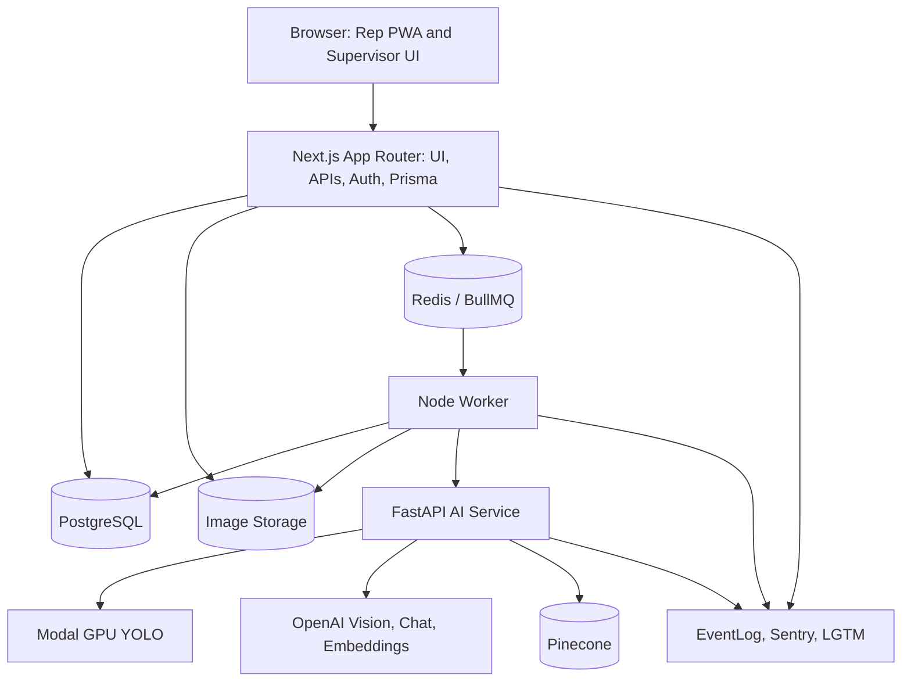

# System Map

## Purpose

RetailOS Lite is an AI-native retail execution workflow:

1. Rep creates a store visit with GPS, notes, outlet identity, and one shelf image.
2. Next.js persists the visit and enqueues async analysis.
3. Worker runs fraud checks and calls the FastAPI AI service.
4. AI service runs YOLO product detection, OpenAI POSM analysis, compliance scoring, and summary generation.
5. Worker saves AI results, fraud signals, visit report text, and queues vector indexing.
6. Supervisors inspect dashboards, visit history, outlet verification, ops timelines, and assistant answers.

## Runtime Topology



```text
Browser
  - Rep PWA flow
  - Supervisor dashboard
  - Assistant UI
  |
  v
Next.js App Router
  - API routes
  - Auth/RBAC
  - Prisma queries
  - Queue enqueue
  |
  +--> PostgreSQL
  |     users, outlets, visits, images, AI results,
  |     fraud signals, reports, event logs
  |
  +--> Redis / BullMQ
  |     analyze_visit
  |     embed_visit_report
  |     analyze_visit_dlq
  |     embed_visit_report_dlq
  |
  +--> Image Storage
        local public/uploads or S3-compatible bucket

Worker
  - consumes analyze_visit
  - fraud checks
  - calls FastAPI
  - saves results
  - sends WhatsApp alerts
  - consumes embed_visit_report
  |
  v
FastAPI AI Service
  - local YOLO or Modal YOLO
  - OpenAI vision POSM analysis
  - compliance scoring
  - OpenAI embeddings
  - Pinecone query/upsert
  - assistant answer generation

Observability
  - EventLog
  - /supervisor/ops
  - Sentry
  - Prometheus
  - Grafana/Loki/Tempo
```

## Service Ownership

| Service | Code | Owns |
| --- | --- | --- |
| Next.js app | `app`, `components`, `lib` | UI, product APIs, auth, Prisma reads/writes, queue enqueue |
| Worker | `worker/src` | Async analysis lifecycle, fraud, persistence, alerts, embedding queue |
| AI service | `ai_service/app` | YOLO, OpenAI POSM, compliance, RAG, assistant generation |
| Database | `prisma/schema.prisma` | Operational state and audit trail |
| Observability | `observability`, `lib/observability`, `worker/src/observability`, `ai_service/app/observability.py` | Logs, metrics, dashboards, traces/errors |

## Core Entities

| Entity | Purpose |
| --- | --- |
| `User` | Rep, supervisor, admin identity and role |
| `Outlet` | Canonical outlet registry record |
| `OutletAlias` | Historical/local names mapped to canonical outlets |
| `OutletSubmission` | Rep-submitted outlet candidate requiring matching/review |
| `Visit` | Store visit lifecycle and check-in metadata |
| `VisitImage` | One uploaded shelf image plus hash/storage metadata |
| `AIResult` | YOLO, POSM, compliance, summary, overlay, raw AI output |
| `FraudSignal` | Actionable fraud findings; `IMAGE_HASHED` is non-actionable metadata |
| `VisitReport` | RAG-ready report facts and retrieval text |
| `EventLog` | Audit and ops timeline source |

## Request/Job Flow

```text
POST /api/visits
  -> resolve or create outlet
  -> create Visit(PENDING)

POST /api/visits/:id/images
  -> store one image
  -> create VisitImage
  -> EventLog UPLOAD_STORED

POST /api/visits/:id/submit
  -> set Visit(ANALYZING)
  -> enqueue analyze_visit
  -> EventLog ANALYZE_VISIT_QUEUED

Worker analyze_visit
  -> run fraud checks
  -> call AI service /analyze-shelf
  -> save FraudSignal, AIResult, VisitReport
  -> set Visit(COMPLETE or FLAGGED)
  -> enqueue embed_visit_report
  -> EventLog ANALYZE_VISIT_COMPLETED

Worker embed_visit_report
  -> call AI service /rag/index-report
  -> Pinecone upsert visit-report:{visitId}
```

## Design Constraints

- Heavy AI work must not run in request handlers.
- Dashboard reads must be database-driven and bounded.
- RAG assistant must prefer exact database context for operational list questions.
- Fraud and compliance decisions must expose reasons.
- Local Docker demo must work without cloud deployment.
- External services must be swappable through env config.
