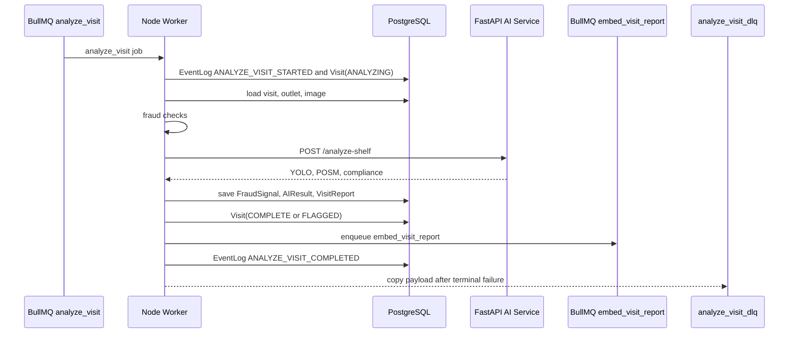

# Worker And Queues

## Purpose

The worker decouples rep submission from expensive AI and fraud processing. Request handlers enqueue work and return quickly; the worker owns analysis, persistence, alerts, and report indexing.

## Queues

| Queue | Job | Purpose |
| --- | --- | --- |
| `analyze_visit` | `analyze_visit` | Full visit analysis lifecycle |
| `embed_visit_report` | `embed_visit_report` | Embed and upsert visit report to Pinecone |
| `analyze_visit_dlq` | `analyze_visit_failed` | Dead-letter copy after terminal analyze failure |

Queue names are env-configurable:

```env
ANALYZE_VISIT_QUEUE=analyze_visit
EMBED_VISIT_REPORT_QUEUE=embed_visit_report
ANALYZE_VISIT_DLQ=analyze_visit_dlq
```

## Enqueue Points

| Enqueue | Code | Trigger |
| --- | --- | --- |
| `enqueueAnalyzeVisit` | `lib/queue.ts` | `POST /api/visits/:id/submit` |
| `enqueueVisitReportIndex` | `lib/queue.ts` | Outlet merge report retargeting |
| worker internal `embedQueue.add` | `worker/src/queue.ts` | Successful visit analysis |

## Analyze Job Payload

```json
{
  "visitId": "visit_123",
  "traceId": "visit_...",
  "useLlm": true
}
```

Job id:

```text
analyze-{visitId}
```

Retry policy:

- `attempts: 3`
- exponential backoff, `2000ms`
- terminal failures copied to DLQ.

## Analyze Lifecycle

Code: `worker/src/jobs/analyzeVisit.ts`



```text
ANALYZE_VISIT_STARTED
  -> Visit(ANALYZING)
  -> load visit, outlet, rep, first image
  -> run fraud checks
  -> FRAUD_CHECKS_COMPLETED
  -> call AI service /analyze-shelf
  -> build AIResult
  -> build outcomeSummary
  -> build VisitReport
  -> save fraud signals
  -> save AI result
  -> save visit report
  -> Visit(COMPLETE or FLAGGED)
  -> VISIT_REPORT_GENERATED
  -> enqueue embed_visit_report
  -> ANALYZE_VISIT_COMPLETED
  -> optional WhatsApp fraud alert
```

Final visit status:

| Condition | Status |
| --- | --- |
| High severity fraud | `FLAGGED` |
| Compliance status `critical` | `FLAGGED` |
| Otherwise | `COMPLETE` |

## Embedding Lifecycle

Code: `worker/src/queue.ts`

```text
embed_visit_report
  -> repository.getVisitReport(visitId)
  -> AI service POST /rag/index-report
  -> Pinecone upsert vector id visit-report:{visitId}
  -> EventLog VISIT_REPORT_INDEXED
```

This same queue is used after outlet merge so stale Pinecone metadata is overwritten.

## Dead-Letter Queue

When an `analyze_visit` job fails its final attempt, the worker adds a copy to `analyze_visit_dlq` with:

- original job id/name
- attempts made
- failed reason
- stacktrace
- original payload
- timestamp

Purpose:

- Preserve payload for debugging.
- Allow replay tooling later.
- Avoid making the rep revisit the store for a transient bug.

## Repository Boundary

Worker repository interface:

```ts
getVisitForAnalysis(visitId)
updateVisitStatus(visitId, status)
updateVisitImage(image)
findImagesByHash(imageHash, excludeVisitId)
findImagesWithPerceptualHash(excludeVisitId)
saveFraudSignals(signals)
saveAIResult(result)
saveVisitReport(report)
getVisitReport(visitId)
addEvent(event)
hasVisitEvent(visitId, event)
```

Implementations:

- `PrismaVisitRepository` for the real database.
- `JsonVisitRepository` as local fallback/dev fixture path.

## Operational Signals

Worker emits:

- structured JSON logs
- Sentry exceptions
- Prometheus metrics
- EventLog records
- queue metrics

Important metadata:

- `visitId`
- `jobId`
- `traceId`
- `stage`
- `latencyMs`
- `status`

## Known Gaps

- DLQ replay command is not implemented.
- Queue cleanup uses bounded `removeOnComplete`/`removeOnFail`, not long-term archival.
- Report indexing failures do not block visit completion; they surface in ops/failures.
